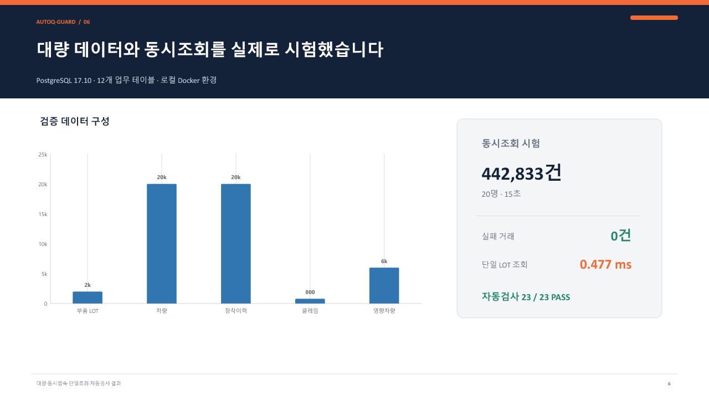
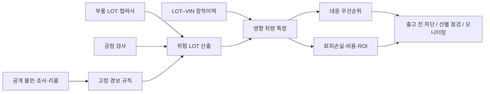

# AutoQ-Guard

### 자동차 부품 LOT부터 VIN·보증수리·리콜 위험까지 연결하는 품질 조기대응 PoC

[](https://www.python.org/)
[](https://www.postgresql.org/)
[](https://www.docker.com/)
[](./ACCEPTANCE_TEST.md)
[](./docs/LIMITATIONS_AND_ENTERPRISE.md)

생산현장에서 부품 불량을 더 일찍 발견하면 출고 전 차단은 물론, 이미 출고된 차량도 문제 LOT가 장착된 VIN만 빠르게 좁힐 수 있습니다. AutoQ-Guard는 이 생각을 공개 리콜 데이터와 합성 생산데이터로 구현하고, 위험 탐지 결과를 **영향 차량 수·예상 손실·대응비용·ROI**로 바꾸어 보여주는 개인 프로젝트입니다.

> 핵심 결론: 조기경보 구조와 기업 데이터 반입 구조는 작동합니다. 다만 실제 예방률과 기업 ROI는 내부 생산·보증수리 데이터로 다시 검증해야 합니다.

## 프로젝트를 30초 안에 보기

| 무엇을 만들었나 | 확인한 결과 | 아직 확정할 수 없는 것 |
|---|---|---|
| LOT–검사–VIN–클레임 연결 | PostgreSQL 12개 업무 테이블 실구동 | 실제 생산라인 탐지율 |
| 공개 리콜 선행신호 백테스트 | 탐지율 20.6%, 정밀도 8.1%, 중앙 선행기간 4.5개월 | 기업별 오탐 비용 |
| 위험 LOT·영향 차량 검색 | 2,000 LOT·20,000대·20명 동시조회 통과 | 실제 예방 차량 수 |
| 손실·비용·ROI 시뮬레이터 | 가정 기반 기준 ROI 34.0% | 기업 확정 ROI |
| 관리자·품질담당자·조회자 권한 분리 | 인증·세션·감사기록·가명처리 구현 | 기업 SSO·KMS·보안관제 연동 |



## 왜 만들었나

기아 AutoLand 광주공장 생산라인에서 차량 문·유리·배선 모듈 조립을 경험했습니다. 작업 중 작은 이상을 검수 전에 잡는 것이 뒤 공정과 출고 품질에 직접 연결된다는 점을 체감했고, 다음 질문에서 프로젝트를 시작했습니다.

1. 공개 불만·조사 신호가 실제 리콜보다 먼저 나타나는가?
2. 부품 LOT와 차량 VIN을 연결하면 대응 범위를 더 정확히 좁힐 수 있는가?
3. 품질 위험을 회사가 판단할 수 있는 원화 손실과 ROI로 바꿀 수 있는가?

## 데이터가 판단으로 바뀌는 과정



## 검증 결과

| 근거 등급 | 데이터와 시험 | 결과 | 올바른 해석 |
|---|---|---|---|
| A · 공개 관측 | NHTSA 기반 현대·기아 공개자료 | 12개월 탐지율 **20.6%**, 정밀도 **8.1%**, 중앙 선행기간 **4.5개월** | 공개 신호의 선행 가능성 확인 |
| B · 합성 기능시험 | 120개 합성 LOT | 사전에 고정한 규칙으로 Blind Gate 통과 | 데이터 연결과 경보 흐름 작동 확인 |
| C · 가정 시뮬레이션 | 차량수·비용·성공률 분포 | 기준 ROI **34.0%**, ROI 10% 이상 확률 **93.6%** | 가정 조건의 경제성 범위 |
| D · 기업 실증 | 미실시 | 미확정 | 내부 데이터로 성능·ROI 재측정 필요 |

### 시스템 시험

- PostgreSQL 17.10, 업무 테이블 12개
- 부품 LOT 2,000개, 차량·장착이력 각 20,000건, 클레임 800건
- 20명·15초 동시조회 442,833건, 실패 0건
- 단일 LOT 조회 0.477ms
- 5종 데이터 통합 중 오류 발생 시 전체 롤백 PASS
- 자동검사 30/30 PASS

성능시험은 로컬 Docker 환경의 제한된 조건에서 수행했습니다. 수치는 상용 운영환경의 처리량 보장이 아니라 구현 검증 결과입니다.

## 주요 화면과 기능

- 종합 현황: 분석 LOT, 고위험 LOT, 관찰 LOT, 영향 VIN
- 위험 분석: 고정 경보규칙과 시간순 모델 비교
- 손익·ROI: 차량 수·차량당 손실·예방률·대응비용을 조정하는 시뮬레이터
- 기업 데이터 반입: CSV 형식·필수값·참조관계 검사 후 격리 적재
- 상세 검색: LOT·VIN·협력사·부품번호·위험등급 조회
- 관리자: 역할별 권한, 계정 상태, 로그인·검색·변경 감사기록

## 실행 방법

### Python

Python 3.10 이상에서 다음 명령을 실행합니다.

```bash
python -m pip install -r requirements.txt
python src/enterprise_pipeline.py enterprise_data/demo_company_raw enterprise_data/demo_company_mapping.json
python src/enterprise_pipeline.py enterprise_data/demo_company_raw enterprise_data/demo_company_mapping.json --public-dir data/public
python src/enterprise_dashboard.py
```

브라우저에서 `http://127.0.0.1:8765`에 접속합니다. 최초 관리자 정보는 로컬 `results/security/초기_관리자_계정.txt`에 한 번만 생성되며 Git에는 포함되지 않습니다.

### Docker

```bash
cp .env.example .env
docker compose up --build
```

`.env`의 비밀번호와 HMAC 키는 강한 임의값으로 교체해야 합니다. 실제 비밀번호·개인정보·기업 내부 데이터는 저장소에 포함하지 않았습니다.

## 기술 구성

| 영역 | 기술 | 적용 내용 |
|---|---|---|
| 분석·백엔드 | Python | 데이터 검증, 위험 산출, ROI 계산, API |
| 데이터베이스 | PostgreSQL, SQLite | 기업형 스키마 검증, 로컬 데모·회귀시험 |
| 화면 | HTML, CSS, JavaScript | 대시보드, 검색, ROI 조정, 관리자 화면 |
| 운영 | Docker Compose | 동일 실행환경 구성 |
| 보안 | PBKDF2, CSRF, 세션, RBAC, HMAC | 비밀번호 해시, 권한 분리, 감사 식별자 가명처리 |
| 시험 | unittest, pgbench | 기능·보안·동시조회·롤백 시험 |

## 기업 데이터 적용 방식

기업 적용 시 새로운 프로그램을 처음부터 만드는 방식이 아니라 아래 표준 입력을 기존 파이프라인에 매핑합니다.

- 부품 LOT·공급사·입고·생산 시각
- 공정 검사값·재검률·설비·작업조건
- LOT–차량 장착 이력과 가명 차량키
- DTC·보증수리·고객불만·수리비
- 조기조치비·물류비·부품비·고객보상비

데이터는 `검사 → 승인 → 격리 적재 → 분석 → 운영 반영` 순서로 처리하며, 중간 오류가 발생하면 전체 거래를 롤백합니다. 기업 데이터가 들어온다고 성능이 자동으로 좋아지는 것은 아닙니다. 대신 해당 기업 기준의 실제 탐지율·오탐 비용·영향 차량·ROI를 측정하고 기준 미달 시 중단할 수 있습니다.

## 경제성 계산

```text
예방 차량 = 고위험 차량 × 조기대응 성공률
회피손실 = 예방 차량 × 출고 후 차량당 비용
총비용 = 조기조치비 + 오탐비 + 준비재고비 + 고정비 + 성과금
순편익 = 회피손실 - 총비용
ROI = 순편익 / 총비용
```

기준 시뮬레이션의 고정비는 2,000만원, 성과금은 검증된 직접 회피손실의 10%(상한 1,500만원), 기업 실증 Gate는 순편익 `> 0` 및 ROI `≥ 10%`입니다. 이 값은 협의 가능한 가정이며 기업 확정치가 아닙니다.

## 한계와 정직한 범위

- 공개데이터는 실제 공정·협력사 LOT와 직접 연결되지 않습니다.
- 합성 LOT 시험은 기능 검증이지 실제 생산성능 증명이 아닙니다.
- 안전부품의 출고 보류·리콜 여부는 모델이 자동 결정하지 않고 품질·안전 책임자가 승인해야 합니다.
- 실제 도입에는 기업 SSO, KMS, 백업·복구, 보안관제, 망 분리 정책 연동이 추가로 필요합니다.
- 기업 내부 데이터 실증 전에는 실제 절감액이나 ROI를 확정값으로 제시하지 않습니다.

## 저장소 구조

```text
AutoQ-Guard/
├─ src/                  분석·검증·대시보드 서버
├─ tests/                기능·보안·동시성·스트레스 시험
├─ ui/                   대시보드 화면
├─ data/                 공개·합성·가정 데이터
├─ enterprise_data/      기업 입력 템플릿과 데모 파일
├─ docs/                 보고서·ERD·보안·검증 문서
├─ Dockerfile
├─ docker-compose.yml
├─ SECURITY.md
└─ README.md
```

## 더 자세히 보기

- [최종 프로젝트 검증 보고서](docs/FINAL_REPORT.md)
- [기업 적용 한계와 남은 과제](docs/LIMITATIONS_AND_ENTERPRISE.md)
- [개인정보·보안 설계](docs/PRIVACY_SECURITY_DESIGN.md)
- [데이터베이스 ERD](docs/database_v2/ENTERPRISE_ERD.md)
- [PostgreSQL 대량시험 결과](docs/database_v2/POSTGRESQL_BULK_TEST_REPORT.md)
- [모델 검증 보고서](docs/model_validation/MODEL_VALIDATION_REPORT.md)
- [공개 저장소 구성 설명](docs/GITHUB_PUBLIC_RELEASE.md)
- [핵심 소스코드 리뷰 가이드](docs/SOURCE_CODE_REVIEW_GUIDE.md)
- [공개자료·기업자료 통합 설계](docs/PUBLIC_ENTERPRISE_INTEGRATION.md)

## 프로젝트 상태

**개인 PoC와 재현성 검증은 완료했습니다. 기업 내부 데이터 실증과 운영 승인은 남아 있습니다.**

이 프로젝트의 목적은 “리콜을 정확히 예언했다”고 주장하는 것이 아니라, 현장에서 발견한 품질 문제를 데이터 구조·조기경보·영향범위·경제성 판단으로 연결하고 기업 실증이 가능한 형태로 만드는 것입니다.


## 시스템 아키텍처

[전체 시스템 구조·역할별 권한·기업 적용 경계 보기](./docs/ARCHITECTURE.md)
