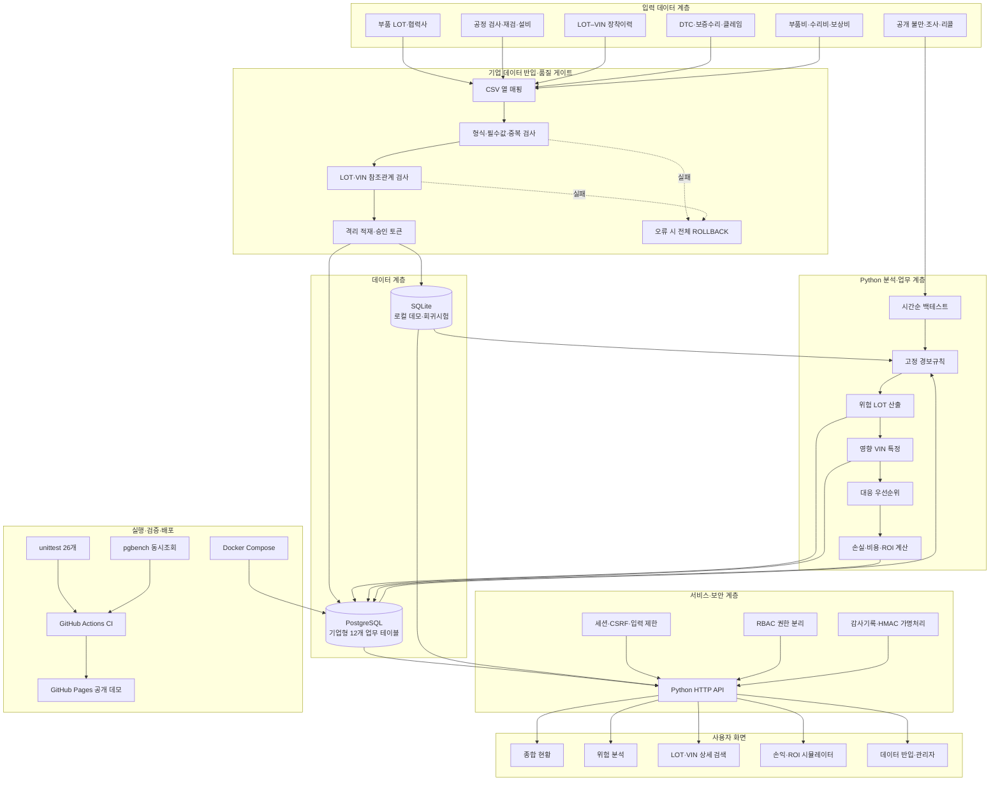
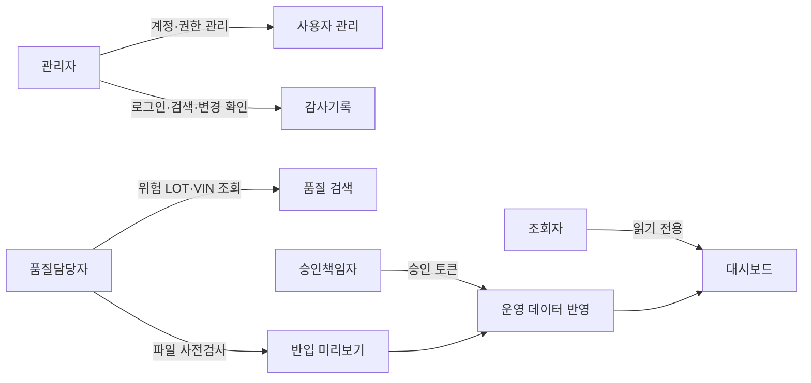
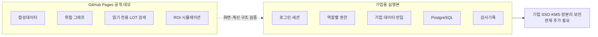

# AutoQ-Guard 시스템 아키텍처

AutoQ-Guard는 부품 생산단위인 LOT에서 시작해 공정검사, 차량 VIN 장착이력, 보증수리·리콜 신호를 연결하고 위험도와 경제성을 함께 보여주는 자동차 품질 조기대응 PoC입니다.

## 전체 구조

## 권한 구조

| 역할 | 허용 범위 | 허용하지 않는 범위 |
|---|---|---|
| 관리자 | 계정·권한·감사기록 관리 | 품질·리콜 최종 판단 자동화 |
| 품질담당자 | 위험조회, 검색, 데이터 사전검사 | 계정관리, 단독 운영반영 |
| 조회자 | 대시보드와 검색 | 데이터 반입·변경 |
| 승인책임자 | 검증 완료 데이터의 운영반영 승인 | 검사 실패 데이터 승인 |

## 공개 데모와 기업용 실행본의 경계

공개 데모에는 실제 개인정보, 기업 내부 데이터, 로그인 정보와 관리자 기능을 포함하지 않습니다. 기업 적용 시에는 데이터 항목 매핑과 시간순 재검증을 거쳐 실제 탐지율·오탐 비용·ROI를 다시 측정해야 합니다.

## 사용 기술과 역할

| 영역 | 기술 | 역할 |
|---|---|---|
| 분석·백엔드 | Python | 데이터 검증, 위험 산출, 영향 VIN 검색, ROI 계산, API |
| 운영 데이터베이스 | PostgreSQL | 12개 업무 테이블, 대량 적재, 인덱스 조회, 트랜잭션 |
| 로컬 시험 | SQLite | 데모 실행과 빠른 회귀시험 |
| 화면 | HTML, CSS, JavaScript | 대시보드, 그래프, 검색, ROI 조절, 관리자 화면 |
| 실행환경 | Docker Compose | Python·PostgreSQL 동일 실행환경 구성 |
| 보안 | PBKDF2, CSRF, 세션, RBAC, HMAC | 인증, 최소권한, 요청보호, 감사 식별자 가명처리 |
| 검증 | unittest, pgbench | 기능·보안·롤백·동시조회 검사 |
| 배포 | GitHub Actions, GitHub Pages | 자동 테스트와 읽기 전용 공개 데모 |

## 검증된 범위와 남은 범위

**검증 완료**

- LOT–검사–VIN–클레임 연결 구조
- 위험 LOT과 영향 차량 검색
- 잘못된 데이터의 반입 차단과 전체 롤백
- 20명·15초 동시조회 442,833건, 실패 0건
- Python 3.10·3.12 자동검사 26개 통과

**기업 데이터로 추가 검증 필요**

- 실제 생산라인 탐지율과 오탐 비용
- 실제 예방 차량 수와 절감액
- 기업 확정 ROI
- SSO·KMS·망 분리·보안관제·백업복구 연동

