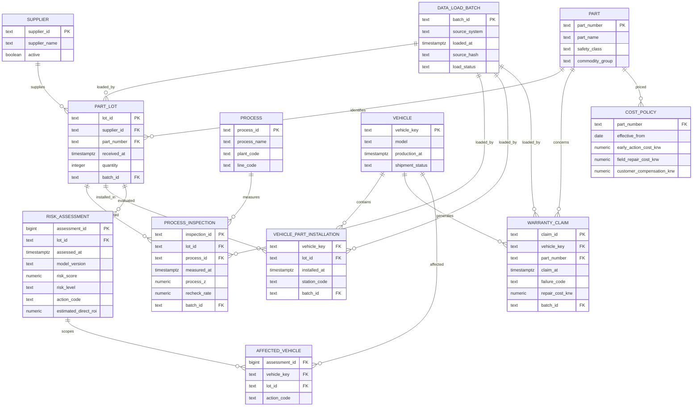

# AutoQ-Guard Enterprise Data Model v2

현재 PoC의 7개 테이블을 기업 파일럿에 필요한 12개 업무 테이블로 정규화한 설계다. 기존 SQLite 실행본은 그대로 유지하고, 이 모델은 PostgreSQL 전환과 기업 데이터 매핑의 기준으로 사용한다.

## 기존 구조보다 개선된 점

- 공급사·부품·공정·차량을 별도 기준정보로 분리해 중복을 줄였다.
- VIN 원문 대신 가명화된 `vehicle_key` 사용을 기본으로 한다.
- 한 차량에 여러 LOT이 장착되는 현실을 설치이력 테이블로 표현한다.
- 위험평가 결과를 실행 시점과 모델 버전별로 누적해 재현할 수 있다.
- 비용 기준에 적용 시작일을 두어 과거 백테스트 당시 비용을 복원할 수 있다.
- 모든 원천 데이터에 적재 배치를 연결해 출처·해시·상태를 추적한다.

## 적용 원칙

1. 기존 SQLite v1은 포트폴리오 시연과 회귀시험용으로 보존한다.
2. PostgreSQL v2는 기업 파일럿용 목표 구조로 사용한다.
3. 실제 회사 컬럼은 표준 컬럼으로 매핑한 뒤 원천값을 변경하지 않고 별도 보존한다.
4. 위험평가는 원천 테이블을 수정하지 않고 새 평가 이력으로 적재한다.
